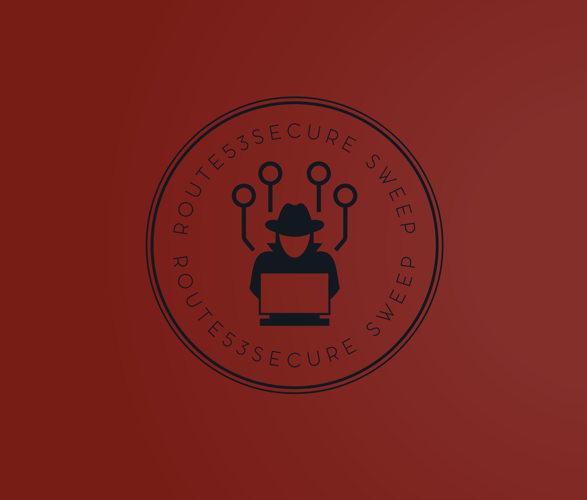

# Route53SecureSweep




## Route53 Scan Sweep Tool Documentation

## Prerequisites

### Before you begin, ensure you have met the following requirements:

    - Python 3.10 or higher installed
    - pip and venv modules for Python
    - Go programming language installed
    - git installed for cloning repositories
    - You have a bash shell available to run scripts
    - Slack webhook configured for alerts.
    - awscli installed & configured with relevant permission to fetch the records from route53.

## Installation

## To set up the Route53 Scan Sweep Tool, follow these steps:

    - Clone the repository to your local machine using git clone followed by the repository URL.
    - Navigate to the root directory of the cloned repository.

## Setup

- To set up the environment for the tool, perform the following steps:
- Open a terminal and navigate to the directory where the tool is located.
- Update `provide-config.yaml` file with the slack webhook.
- Source the start.sh script to create and activate the virtual environment:

```
source start.sh
```
- In case, dependencies are not installed.

```
python3 -m pip install -r requirements.txt
```

## Tool Installation

### Ensure that the following tools are installed and working on your system:

    - Go: Verify the installation of Go by running go version in the terminal.
    
    ```
      export GOPATH=$HOME/go
      export PATH=$PATH:/usr/local/go/bin:$GOPATH/bin
    ```
    - Nuclei: Check if Nuclei is installed and working by running nuclei -version.
    - Anew: Verify Anew installation with anew -h.
    - Notify: Ensure Notify is installed with notify -version.
    - Httpx: Confirm that Httpx is installed by running httpx -version.

- These tools are essential for the Route53 Scan Sweep to function correctly. If any of these are not installed, please install them according to their respective documentation.

## Dependencies

### The Route53 Scan Sweep tool relies on several dependencies:

    - Nuclei Templates: These are fetched automatically if they are not present.
    - External Bash scripts: The tool runs several bash scripts located in the checks directory. Ensure they are present and have execute permissions.
    - Provider Configuration: Modify the provider-config.yaml with the correct configuration for the notification system you plan to use.

## Running the Tool

### To run the Route53 Scan Sweep Tool, execute the run_scripts.py script:

```
python run_scripts.py
```

### The script will perform the following actions:

    - Check and install the required dependencies.
    - Fetch Route53 data.
    - Run additional scripts to gather public endpoints from AWS.
    - Perform Nuclei subdomain and AWS public endpoint scans.
    - Notify the results to the configured provider.

- The results will be stored in the final_results directory.

### Help

- If you encounter any issues, refer to the error/r53_error_log.txt file for error logs that can provide insights into what might have gone wrong.

- For more detailed information about each step or if you need to troubleshoot a specific part of the tool, consult the comments in the run_scripts.py script.

  
## License

- Refer to the LICENSE file for the licensing information regarding the use and distribution of this tool.
